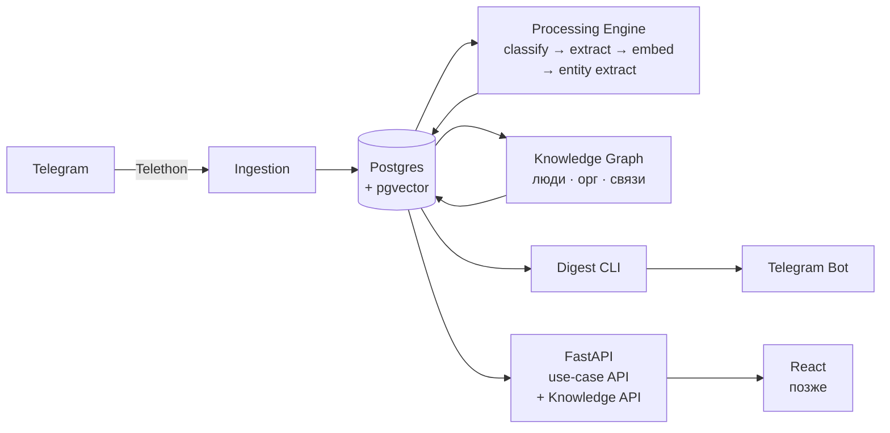

# ReplyRadar

Персональный слой навигации по Telegram-перепискам.  
Отслеживает обещания, незакрытые вопросы и контекст — без автоответчика и без слежки.

---

## Для кого это

Для человека, у которого узкое место — не количество сообщений, а потерянные договорённости, пропущенные вопросы и стоимость возврата в контекст после нескольких часов офлайна.

---

## Что делает

- извлекает `commitments` — кто кому что обещал
- находит `pending replies` — вопросы без ответа, треды без завершения
- замечает `communication risks` — напряжённые точки, задержки после важного сообщения
- строит короткое резюме по каждому чату
- ведёт базу знаний о людях и организациях — факты, связи, провенанс
- отдаёт дайджест по запросу в Telegram

---

## MVP flow

```
1. Подключить Telegram-аккаунт через Telethon
2. Выбрать чаты для мониторинга: POST /chats/{id}/monitor
3. Загрузить историю: POST /backfill (обрабатывает всё с начала)
4. Получить картину дня: GET /today
   → pending replies с urgency=high
   → open commitments, срок которых наступил
   → active communication risks
5. Посмотреть что известно о человеке: GET /people/{id}
   → факты о нём с оценкой уверенности
   → связи с другими людьми и организациями
   → сообщения, из которых это извлечено
6. Запросить дайджест: python -m replyradar digest
   → текст приходит в Telegram Bot
```

---

## Быстрый старт

```bash
# Зависимости
make install

# Postgres с pgvector
make db-up
make migrate

# API
make dev          # http://localhost:8000
# GET /status — состояние компонентов
```

Конфигурация через `.env` (скопировать из `.env.example`):

```bash
cp .env.example .env
# отредактировать DATABASE__URL при необходимости
```

LLM-стадии требуют запущенного [LM Studio](https://lmstudio.ai) на порту 1234.  
До его настройки ingestion и `/status` работают, обработка откладывается.

---

## Архитектура



Подробнее: [architecture.md](./docs/architecture.md)

---

## Почему не очередной AI-чат-инструмент

Большинство инструментов в этой категории пытаются отвечать за пользователя.  
ReplyRadar помогает думать, а не делегирует суждение:

- работает с выбранными чатами, не со «всей цифровой жизнью»
- LLM локальный — данные не уходят на сторону
- не отправляет ничего от имени пользователя
- не меняет статус прочтения в Telegram

---

## О `communication_risks`

Самая деликатная часть продукта.

Это эвристические гипотезы — не психологический диагноз и не телепатия.  
Примеры: задержка ответа после эмоционального сообщения, вопрос без реакции в течение нескольких дней.  
Система не знает «что человек на самом деле чувствует». Она замечает паттерны и предлагает обратить внимание.

---

## Приватность

- LLM запускается локально через LM Studio
- тексты сообщений не попадают в stdout-логи — только ID и метрики
- удаление чата удаляет все данные каскадно, включая embeddings

---

## Статус

Этап 1 завершён: фундамент работает.

| Этап | Статус | Что |
|------|--------|-----|
| 1. Фундамент | ✓ | src-layout, config, DB pool, Alembic схема, `GET /status`, import boundaries |
| 2. Ingestion | — | Telethon listener, backfill, `POST /chats/{id}/monitor` |
| 3. Processing Core | — | classify, extract, embed, quarantine |
| 4. API сценариев | — | `/today`, `/pending`, `/commitments`, `/risks` |
| 5. Entity Knowledge Graph | — | извлечение сущностей, граф, activation model |
| 6. Knowledge API | — | `/people`, `/orgs`, транзитивные запросы |
| 7. Summarizer и Digest | — | per-chat summary, Telegram Bot |
| 8. Scheduler и ops | — | APScheduler, Docker, runbooks |

---

Этот репозиторий — попытка ответить на вопрос, который в реальных AI-продуктах часто обходят стороной: можно ли построить систему, работающую с личными данными, которая остаётся управляемой при смене моделей, честной в своих гарантиях и пригодной к эксплуатации — а не только к демонстрации.

---

## Документация

- [Архитектура](./docs/architecture.md)
- [Файловая структура](./docs/structure.md)
- [План разработки](./docs/plan.md)
- [Глоссарий](./docs/glossary.md)
- [Архитектурные решения (ADR)](./docs/adr/README.md)
- [Карта пользовательского пути](./docs/cjm.md)
- [Evals](./evals/README.md)
