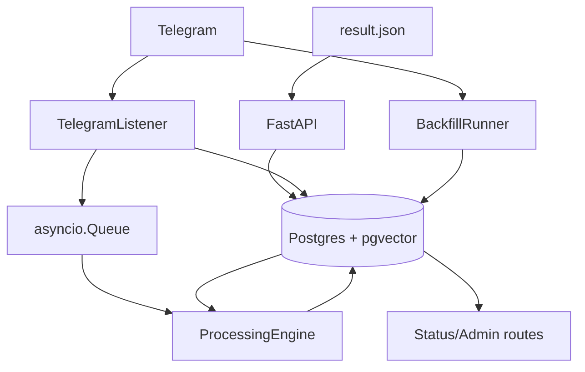

# Architecture

## Статус документа

Этот файл описывает текущую реализованную архитектуру и отдельно помечает ближайшие planned-слои. Он не должен читаться как список уже существующих API.

## Принципы

- Postgres остаётся источником истины
- ingestion и API стартуют даже при частичной деградации зависимостей
- processing идемпотентен: незавершённые стадии добираются повторно
- пользовательские тексты не должны попадать в обычные логи
- runtime пока однопроцессный: API, listener и processing живут в одном приложении

## Текущая схема



## Реализованные компоненты

### FastAPI app

`replyradar.api.app` создаёт приложение и подключает четыре группы роутов:

- `/status`
- `/chats/...`
- `/import/telegram-export`
- `/admin/quarantine/...`

Lifespan поднимает компоненты через `bootstrap.create_components()` и складывает их в `app.state`.

### Bootstrap / composition root

`bootstrap.py` сейчас инициализирует:

- пул БД
- `asyncio.Queue[int]` для realtime-сообщений
- `LLMClient`
- `ProcessingEngine`, если доступна БД
- `TelegramListener`, если настроен Telethon и доступна БД
- `BackfillRunner`, если доступны и БД, и listener

Это соответствует ADR-0003: один процесс, без отдельных worker-сервисов.

### Ingestion

Есть три входа данных:

1. `TelegramListener` принимает realtime-сообщения из уже monitor-чата, сохраняет их в `messages` и кладёт `message_id` в очередь.
2. `BackfillRunner` тянет историю через `iter_messages`, сохраняет батчами и обновляет статус для `GET /backfill/status`.
3. `POST /import/telegram-export` парсит `result.json` и импортирует сообщения напрямую в БД без Telegram-соединения.

Дубли гасятся уникальностью `(chat_id, telegram_msg_id)` и `ON CONFLICT DO NOTHING`.

### Processing engine

`ProcessingEngine` обслуживает два источника работы:

- realtime через `asyncio.Queue`
- backlog через периодический SQL-select из `messages`

Приоритет всегда у realtime. Backfill-loop ждёт, если очередь непуста.

Реализованные стадии:

| Стадия | Условие запуска | Что пишет |
|---|---|---|
| `classify` | все сообщения | `is_signal`, `classified_at`, `classify_error` |
| `embed` | после classify | `embedding`, `embedded_at`, `embed_error` |
| `extract` | только `is_signal = true` | сигналы в отдельных таблицах, `extracted_at`, `extract_error` |

На стороне extract сейчас создаются записи в:

- `commitments`
- `pending_replies`
- `communication_risks`

Ошибки стадий проходят через retry в памяти и затем отправляются в `processing_quarantine`.

### Status / admin surface

Реально существующие read/admin точки входа:

```text
GET  /status
POST /chats/{telegram_id}/monitor
POST /backfill
GET  /backfill/status
POST /import/telegram-export
GET  /admin/quarantine
POST /admin/quarantine/{quarantine_id}/reprocess
POST /admin/quarantine/{quarantine_id}/skip
```

`/status` возвращает состояние компонентов и текущий backlog по нескольким стадиям.

## Деградация и отказоустойчивость

### База данных недоступна

- приложение всё равно стартует
- `pool=None`, `/status` покажет `db: error`
- ingestion и processing не активируются

### Telegram не настроен или не авторизован

- listener не стартует или переходит в `not_authorized`
- импорт Telegram Desktop export остаётся доступным
- `POST /backfill` может работать в DB-only режиме и просто будить backlog processing

### LM Studio недоступен

- ingestion продолжает складывать данные в БД
- processing останавливается на LLM-зависимых стадиях
- backlog остаётся в `messages` и добирается после восстановления LLM

## Что пока не реализовано

Следующие элементы присутствуют в roadmap, ADR или заготовках пакетов, но не в текущем runtime:

- scenario API: `/today`, `/pending`, `/commitments`, `/risks`
- knowledge graph и API `/people`, `/orgs`
- digest / summarizer
- scheduler
- расширенные admin-метрики типа `/admin/metrics`

Если документ ссылается на них, он должен явно помечать это как future design.
