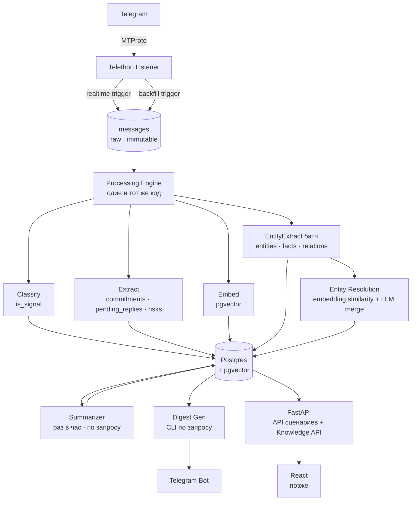

# Architecture

## Принципы

- **Ingestion с ограниченными гарантиями** — работает независимо от LLM; при падении Postgres теряет сообщения (история восстанавливается через backfill)
- **Обработка идемпотентна** — можно прервать, перезапустить, повторить в любой момент
- **Postgres — единственный источник истины** — очередь только транспорт, не состояние
- **Деградация явная** — каждый компонент знает, что делать при отказе соседа
- **Никаких пользовательских текстов в логах** — в stdout только ID, метрики, статусы

---

## Высокоуровневая схема



---

## Компоненты и их границы

### Telegram Listener — критический путь
Единственный компонент, отказ которого означает потерю данных.

- **Telethon** (MTProto, пользовательский аккаунт)
- `.session` файл в Docker volume `/data/session`
- При первом подключении чата — полная выгрузка истории (`iter_messages`, без лимита, от старых к новым)
- При обрыве соединения — автоматический reconnect с экспоненциальным backoff
- Дубли при пересечении истории и realtime stream — защита через `INSERT ... ON CONFLICT (telegram_message_id) DO NOTHING`
- `mark_read()` и `send_read_acknowledge()` **нигде не вызываются**

Политика отказа:
- потеря Telegram-соединения → reconnect, сообщения не теряются (Telegram хранит историю)
- недоступность БД → ingestion best-effort: сообщения теряются, история восстанавливается вручную через backfill из Telegram

Post-MVP: durable ingest buffer (SQLite/WAL-файл) — первый кандидат на усиление при ежедневном использовании.

### Движок обработки — режим с ограниченными гарантиями
Один и тот же код обслуживает realtime и backfill. Разница только в источнике задач.

**Источник задач:**
- realtime: `asyncio.Queue`, куда Listener кладёт новые message_id
- backfill: запрос к БД `WHERE classified_at IS NULL ORDER BY timestamp ASC`

**Приоритет:** realtime > backfill. Если realtime queue непуста, backfill ждёт.

**Concurrency backfill:** ограничен одним воркером (конфиг `backfill.concurrency = 1`).

### Стадии обработки

Каждая стадия пишет результат в БД и ставит timestamp. Упавшая стадия оставляет timestamp NULL — будет подхвачена при следующем запуске.

| Стадия | Флаг на `messages` | Условие запуска | При ошибке |
|---|---|---|---|
| Classify | `classified_at`, `classify_error` | всегда | пишет `classify_error`, retry при следующем запуске |
| Extract | `extracted_at`, `extract_error` | `is_signal = true` | пишет `extract_error`, retry |
| Embed | `embedded_at`, `embed_error` | после classify | пишет `embed_error`, retry |
| EntityExtract | `entities_extracted_at`, `entities_extract_error` | все сообщения, батчами | пишет `entities_extract_error`, retry |

Summary — не per-message, а per-chat. Обновляется отдельно.

**Частичный успех:** каждая стадия независима. Если extract упал — classify и embed не откатываются. При следующем запуске упавшая стадия будет перезапущена, успешные — пропущены.

**EntityExtract** запускается батчами (не per-message) для снижения числа LLM-вызовов. Один вызов на батч сообщений, результат раскидывается по всем message_id батча. Backfill entity extraction: `WHERE entities_extracted_at IS NULL ORDER BY timestamp ASC`.

### LLM — все локальные
Все вызовы идут в **LM Studio** на локальной машине. LiteLLM используется как единый интерфейс.

```yaml
llm:
  base_url: http://host.docker.internal:1234/v1
  model: local-model
  api_key: lm-studio

embedding:
  provider: lmstudio
  model: text-embedding-nomic-embed-text-v1.5
  base_url: http://host.docker.internal:1234/v1

backfill:
  batch_size: 20
  delay_between_batches_ms: 0
```

Политика отказа LLM:
- LM Studio недоступен → сообщения попадают в ingestion, обработка откладывается
- все timestamp'ы остаются NULL
- при следующем запуске обработка продолжается автоматически

### Summarizer — batched
Summary обновляется:
- по расписанию: раз в час (APScheduler)
- по запросу: `POST /chats/{id}/summarize`

### Digest Generator
MVP: **operator-invoked workflow**.

- запускается вручную из CLI
- строится из стабильной read-model
- при недоступности LM Studio печатает сырые факты без LLM-нарратива

### Entity Knowledge Graph — база знаний

Накапливает знания о людях и организациях, упомянутых в переписках: что они говорили о себе, что о них говорили другие, в каких сообщениях это зафиксировано.

**Люди и организации — единая таблица `entities`** с полем `entity_type`. Организации как полноправные узлы графа нужны для транзитивных цепочек: "Иван директор фирмы → в фирме работает Елена → Елена встречается с Виктором".

**Две структуры хранения:**
- `entity_facts` — атрибуты одной сущности (роль, место работы, черта характера)
- `entity_relations` — рёбра между двумя сущностями (works_with, reports_to, dating, knows, …)

**Транзитивные запросы** реализованы через рекурсивные CTE по `entity_relations`. Уверенность по цепочке перемножается — глубокие связи автоматически получают меньший вес без дополнительной логики.

**Ненаправленные связи** (knows, friends_with, dating) хранятся один раз (`is_directional = false`), запросы проверяют оба направления.

**Entity resolution:** при каждом извлечении новая сущность сопоставляется с существующими по embedding similarity. При схожести > 0.85 — LLM подтверждает merge. Иначе создаётся новая запись.

**Система уверенности** (подробнее в ADR-0007):
- `base_confidence` — оценка LLM при извлечении
- `source_type` — self / other / inferred (весовые коэффициенты: 1.0 / 0.7 / 0.5)
- `corroboration_count` — число независимых сообщений-подтверждений
- `contradiction_count` — число противоречащих сообщений
- Затухание по времени: период полураспада 1 год
- Финальная оценка вычисляется при запросе, не хранится

### FastAPI — API сценариев и база знаний

```
GET  /today
GET  /pending
GET  /commitments
GET  /risks
GET  /chats/{id}/summary
POST /chats/{id}/monitor
POST /backfill
GET  /backfill/status
POST /chats/{id}/summarize
GET  /status

# Entity Knowledge Graph
GET  /people                         # список людей с базовыми фактами
GET  /people/{id}                    # профиль: факты + прямые связи
GET  /people/{id}/connections        # транзитивный граф до N хопов
GET  /people/{id}/timeline           # факты в хронологическом порядке
GET  /people/{id}/messages           # сообщения, породившие факты
GET  /people/search?q=               # поиск по имени / алиасам
POST /people/{a}/merge/{b}           # ручная склейка двух записей
POST /people/{a}/relate/{b}          # ручное добавление связи
GET  /orgs/{id}                      # профиль организации
```

---

## База данных

```sql
-- Entity Knowledge Graph

entities
  id              uuid PK
  entity_type     text NOT NULL        -- 'person' | 'organization'
  canonical_name  text NOT NULL
  aliases         text[]               -- альтернативные имена и написания
  telegram_ids    bigint[]             -- TG user_id (только для person)
  first_seen_at   timestamptz
  updated_at      timestamptz
  embedding       vector(768)          -- для entity resolution

entity_facts
  id                  uuid PK
  entity_id           uuid FK → entities
  fact_type           text             -- 'role' | 'employer' | 'location' | 'trait' | 'contact' | 'other'
  fact_key            text             -- структурированный ключ (NULL если fact_type='other')
  fact_value          text
  source_type         text             -- 'self' | 'other' | 'inferred'
  said_by_entity_id   uuid FK → entities
  message_id          bigint FK → messages
  chat_id             bigint FK → chats
  base_confidence     float
  corroboration_count int DEFAULT 0
  contradiction_count int DEFAULT 0
  first_seen_at       timestamptz
  last_confirmed_at   timestamptz
  superseded_by       uuid FK → entity_facts
  extraction_model    text
  prompt_version      text
  embedding           vector(768)

entity_relations
  id                  uuid PK
  entity_a_id         uuid FK → entities
  relation_type       text             -- works_with | works_at | reports_to | manages | founded |
                                       -- owns | member_of | knows | friends_with | dating |
                                       -- married_to | family_of | ex_of | related_to
  entity_b_id         uuid FK → entities
  is_directional      boolean DEFAULT true
  claim_text          text             -- дословная фраза из сообщения
  source_type         text
  said_by_entity_id   uuid FK → entities
  message_id          bigint FK → messages
  chat_id             bigint FK → chats
  base_confidence     float
  corroboration_count int DEFAULT 0
  contradiction_count int DEFAULT 0
  first_seen_at       timestamptz
  last_confirmed_at   timestamptz
  expired_at          timestamptz
  superseded_by       uuid FK → entity_relations
  extraction_model    text
  prompt_version      text

-- Защита от двойного счёта corroboration из одного треда
entity_fact_sources
  fact_id     uuid FK → entity_facts
  message_id  bigint FK → messages
  seen_at     timestamptz
  PRIMARY KEY (fact_id, message_id)

entity_relation_sources
  relation_id uuid FK → entity_relations
  message_id  bigint FK → messages
  seen_at     timestamptz
  PRIMARY KEY (relation_id, message_id)

-- Основные таблицы

chats
  id              bigint PK
  telegram_id     bigint UNIQUE
  title           text
  is_monitored    boolean DEFAULT false
  history_loaded  boolean DEFAULT false
  created_at      timestamptz

messages
  id              bigint PK
  chat_id         bigint FK → chats
  telegram_msg_id bigint
  sender_id       bigint
  sender_name     text
  timestamp       timestamptz
  text            text
  reply_to_id     bigint
  is_signal       boolean
  classified_at   timestamptz
  classify_error  text
  extracted_at    timestamptz
  extract_error   text
  embedded_at              timestamptz
  embed_error              text
  embedding                vector(768)
  entities_extracted_at    timestamptz
  entities_extract_error   text
  UNIQUE(chat_id, telegram_msg_id)

chat_summaries
  chat_id              bigint PK FK → chats
  summary              text
  key_topics           text[]
  importance_score     float
  updated_at           timestamptz
  model                text
  prompt_version       text
  source_window_start  timestamptz
  source_window_end    timestamptz
  is_full_rebuild      boolean
  embedding            vector(768)

commitments
  id                uuid PK
  source_fingerprint text UNIQUE
  closure_reason    text
  chat_id           bigint FK
  message_id        bigint FK
  author            text
  target            text
  text              text
  due_hint          text
  status            text
  status_changed_at timestamptz
  superseded_at     timestamptz
  inactive_reason   text
  extraction_model  text
  prompt_version    text
  embedding         vector(768)

pending_replies
  id                uuid PK
  source_fingerprint text UNIQUE
  chat_id           bigint FK
  message_id        bigint FK
  reason            text
  urgency           text
  resolved_at       timestamptz
  superseded_at     timestamptz
  inactive_reason   text
  extraction_model  text
  prompt_version    text

communication_risks
  id               uuid PK
  chat_id          bigint FK
  message_id       bigint FK
  type             text
  confidence       float
  explanation      text
  expired_at       timestamptz
  extraction_model text
  prompt_version   text
```

---

## Data Lifecycle

### Retention
- Raw messages — бессрочно
- Embeddings — удаляются каскадно вместе с сообщением
- Superseded facts — бессрочно для аудита
- Логи — stdout, не персистируются системой

### Удаление чата
`DELETE /chats/{id}` удаляет raw и derived данные физически, включая superseded записи.

### Резервное копирование
Ответственность пользователя: `pg_dump` или snapshot Docker volume.

---

## Quality Evaluation

Для MVP — ручная офлайн-проверка на 2–3 чатах с фиксацией промахов в `evals/`.
